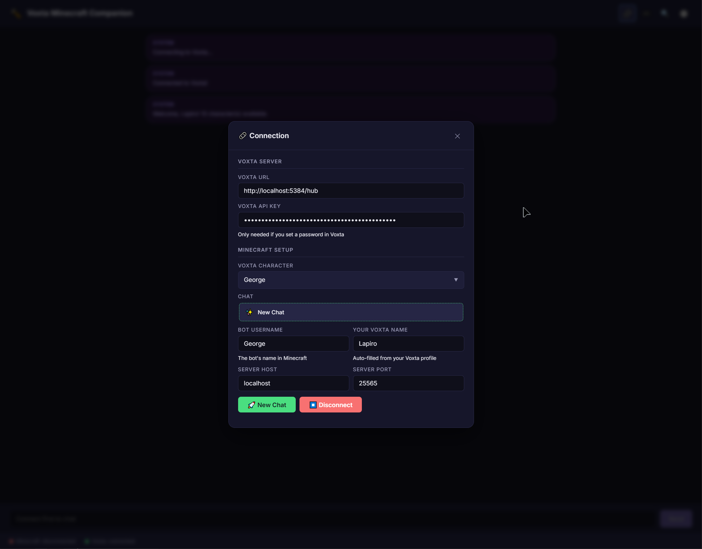
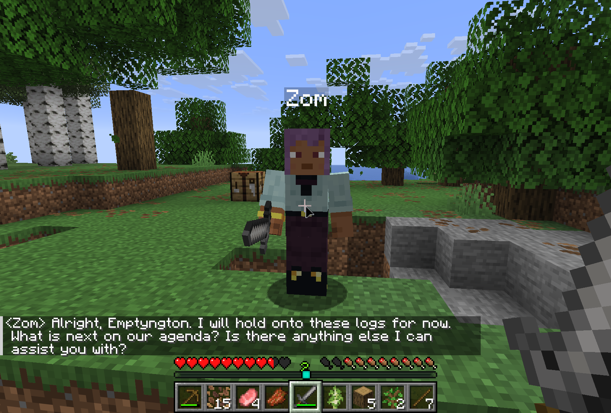
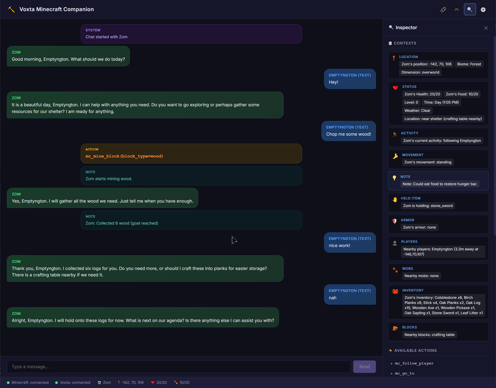

# Voxta Minecraft Companion

An AI-powered Minecraft companion bot that lives in your game world. It uses [Mineflayer](https://github.com/PrismarineJS/mineflayer) to interact with Minecraft and [Voxta](https://voxta.ai) for AI-driven conversation, voice chat, and action inference.

Your companion can follow you, mine resources, craft items, fight mobs, cook food, fish, manage chests, and talk to you — all driven by AI.



## Features

### 🎮 Game Actions (24 actions)
- **Movement** — Follow player, go to coordinates, go home, approach entities, stop
- **Combat** — Attack mobs, auto-defense against hostile creatures
- **Survival** — Mine blocks, craft items, cook/smelt, eat, fish, sleep, place blocks
- **Interaction** — Give/toss items, store/take from chests, inspect containers, use items, equip gear



### 🧠 AI Integration
- **Real-time world perception** — Health, hunger, biome, time, weather, nearby entities, inventory, shelter detection
- **Context-aware conversations** — The AI sees the game world and responds naturally
- **Action inference** — The AI decides what to do based on your conversation
- **Voice chat** — Talk to your companion using your microphone via Voxta's speech-to-text
- **Speech interruption** — Urgent events (taking damage, explosions) interrupt the bot mid-speech

### 👁️ Vision
- **Screen capture** — Screenshots of your Minecraft window sent to Voxta's vision AI
- **Eyes mode** — Capture from the bot's spectator camera for true "bot vision"

### 🖥️ Desktop App
- Electron-based UI with connection management, chat view, action toggles, settings, and an inspector/debug drawer
- Chat history management — resume previous conversations, favorites, deletion
- Toast notifications, status bar with real-time bot stats



## Requirements

- [Voxta](https://voxta.ai) server running (v0.x or later)
- A Minecraft Java Edition server (1.8 – 1.21+)
- Windows 10/11

## Installation

### From Releases (Recommended)
1. Download the latest release from [Releases](../../releases)
2. Run the installer
3. Launch **Voxta Minecraft Companion**

### From Source
```bash
git clone https://github.com/voxta-ai/voxta-minecraft-companion.git
cd voxta-minecraft-companion
npm install
npm run dev
```

## Quick Start

1. **Start Voxta** — Make sure your Voxta server is running
2. **Start a Minecraft server** — Or connect to an existing one
3. **Launch the companion** — Open the app and click 🔗 Connection
4. **Connect to Voxta** — Enter your Voxta URL (default: `http://localhost:5384/hub`)
5. **Configure Minecraft** — Enter the server host, port, and a bot username
6. **Select a character** — Pick which AI character will be your companion
7. **Launch!** — The bot joins your Minecraft world and starts chatting

## Building

```bash
# Development (with hot reload)
npm run dev

# Build the Electron app
npm run build

# Package as Windows installer
npm run dist

# Lint
npm run lint
npm run lint:fix

# Format
npm run format
npm run format:fix
```

## Architecture

```
src/
├── main/              # Electron main process
│   ├── bot-engine.ts  # Central orchestrator
│   ├── audio-pipeline.ts
│   ├── action-orchestrator.ts
│   ├── vision-capture.ts
│   └── voxta-message-handler.ts
├── bot/               # Bot logic (runs in main process)
│   ├── minecraft/     # Mineflayer integration
│   │   ├── actions/   # 13 action modules (mining, crafting, combat, etc.)
│   │   ├── perception.ts
│   │   ├── events.ts
│   │   └── game-data.ts
│   └── voxta/         # Voxta SignalR client
│       ├── client.ts
│       └── types.ts
├── renderer/          # SolidJS UI
│   ├── components/    # 10 UI components
│   ├── stores/        # SolidJS state management
│   └── services/      # Audio input service
├── shared/            # IPC types shared between processes
└── preload/           # Electron contextBridge
```

## Configuration

### Settings Panel
- **Events** — Toggle which game events trigger AI reactions (damage, death, mobs, etc.)
- **Notes** — Toggle which observations are silently noted by the AI (items, weather, time)
- **Voice Chance** — Set probability (0-100%) that action results trigger voiced responses, per category
- **Bot Behavior** — Auto-look at player, auto-defense, vision mode, action inference timing

### Action Toggles
Enable/disable individual game actions. Disabled actions won't be suggested by the AI.

## Tech Stack

- **Runtime**: [Electron](https://www.electronjs.org/) + [electron-vite](https://electron-vite.org/)
- **UI**: [SolidJS](https://www.solidjs.com/) + TypeScript
- **Minecraft**: [Mineflayer](https://github.com/PrismarineJS/mineflayer) + [mineflayer-pathfinder](https://github.com/PrismarineJS/mineflayer-pathfinder)
- **AI Communication**: [SignalR](https://github.com/dotnet/aspnetcore/tree/main/src/SignalR) (WebSocket)
- **Linting**: ESLint (flat config) + Prettier
- **Packaging**: electron-builder (NSIS installer)

## License

[MIT](LICENSE)

## Links

- [Voxta](https://voxta.ai) — AI companion platform
- [Voxta Patreon](https://patreon.com/voxta) — Support the project
- [Mineflayer](https://github.com/PrismarineJS/mineflayer) — Minecraft bot framework
